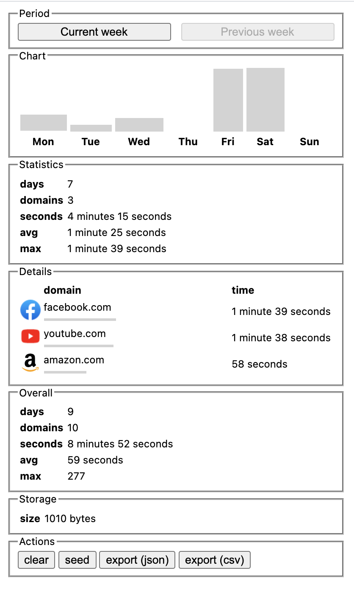

# Screen Time for Google Chrome

Extension will collect screen time for active tabs

https://chrome.google.com/webstore/detail/screen-time/plckpjcbdofdpbljigbjkohpfccafged

https://youtu.be/il2AdM_O-AA



## Notes

- Only active tabs are counted
- Losing focus - stops count
- Data stored locally, nothing sent anywhere

## Local development

Just clone repository and add its content as unpacked extension

For popup just grab extension id and open:

```
chrome-extension://pehaekcdnmnpfnhhekjfkcicjdblphpj/popup.html
```
